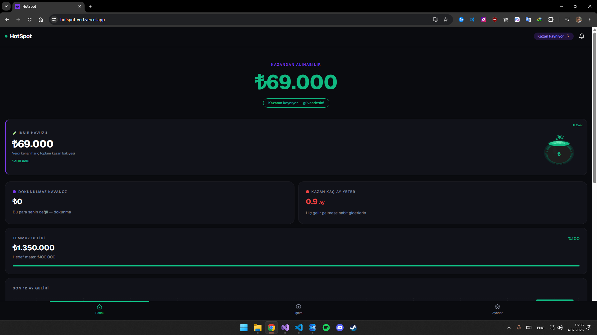
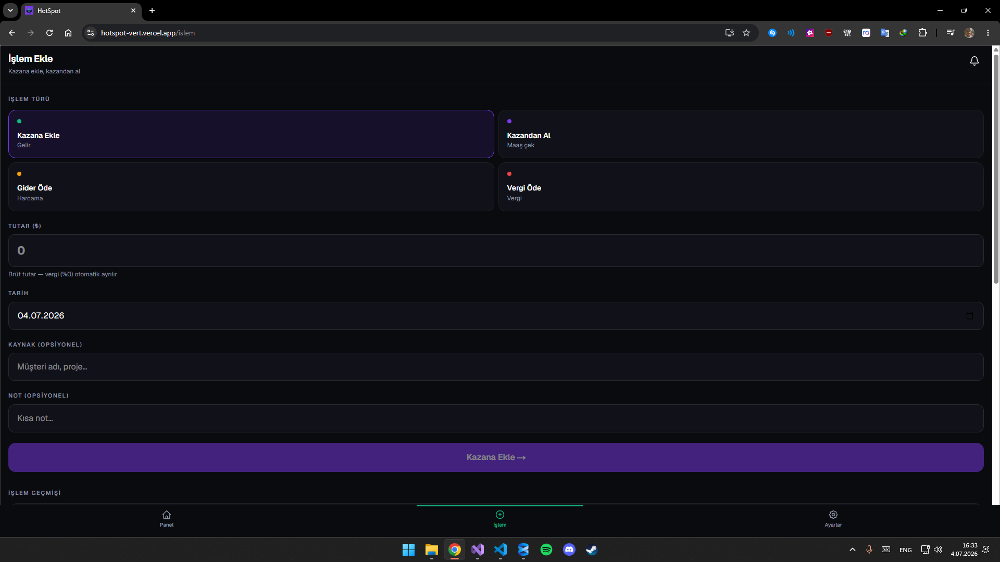
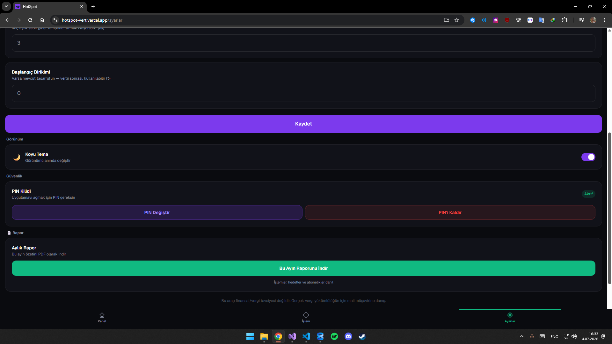

# HotSpot 🪄

Freelancer, gig çalışan ve serbest meslek sahipleri için düzensiz gelir bütçe asistanı.

HotSpot, geliri ay ay değişen herkes için tasarlandı: yazılımcılar, tasarımcılar, danışmanlar, içerik üreticileri, esnaf ve proje bazlı çalışan herkes. Klasik bütçe uygulamaları sabit, düzenli bir maaş varsayar; HotSpot ise serbest çalışmanın gerçeğini merkezine koyar — "bu ay bolca geldi ama gelecek ay hiç gelmeyebilir." Vergi payını otomatik ayırır, bir güvenlik tamponu tutar ve geri kalanın ne kadarının güvenle harcanabileceğini saniyeler içinde söyler.

Bu proje, serbest çalışırken sürekli karşılaşılan iki soruna doğrudan çözüm üretmek için yapıldı: *"Bu parayı harcayabilir miyim, yoksa vergiye mi ayırmam gerekiyor?"* ve *"Hiç iş gelmese kaç ay dayanırım?"*. Tüm hesaplamalar cihaz üzerinde yapılır — veri hiçbir sunucuya gönderilmez, hesap oluşturmaya gerek yoktur, kurulum saniyeler sürer.

**Tek soru:** "Bu ay X geldi ama gelecek ay belirsiz — ne kadarını güvenle harcayabilirim?"

**Canlı:** https://hotspot-vert.vercel.app

## Ekran Görüntüleri

| Panel | İşlem Ekle | Ayarlar |
| --- | --- | --- |
|  |  |  |

## Ne yapar?

- **Güvenle harcanabilir tutar** 💚
  Anlık olarak ne kadar harcayabileceğini büyük bir rakamla gösterir. Hedef aylık maaşın ile tampon üstü bakiyenin küçüğünü baz alır, böylece asla güvenlik tamponuna dokunmazsın.

- **Vergi kenarı — Dokunulmaz Kavanoz** 🧾
  Her gelir eklendiğinde, ayarladığın vergi oranına göre otomatik olarak bir pay ayrılır. Bu tutar harcanabilir bakiyene hiçbir zaman dahil edilmez.

- **Kazan süresi (runway)** ⏳
  Sabit aylık giderlerine göre, hiç gelir gelmese kaç ay dayanabileceğini hesaplar. Serbest çalışmanın belirsizliğine karşı somut bir güvenlik ölçütü sunar.

- **Abonelik dedektörü** 💸
  Gider geçmişini tarar, aynı kaynağa yapılan tekrarlayan ödemeleri otomatik tespit eder ve bunları abonelik olarak eklemeni önerir. Unutulan ya da otomatik yenilenen ödemeler artık gözden kaçmaz.

- **Hedef takibi** 🎯
  Birikim hedefleri oluştur (araba, tatil, laptop vb.), kazandan doğrudan hedefe para aktar. Hedefe %100 ulaşınca konfetiyle kutlanır, son tarihe yaklaşınca uyarır.

- **PIN kilidi** 🔐
  4 haneli PIN ile uygulamanı yetkisiz erişime karşı korursun. Uygulama arka plana alınıp bir süre sonra geri dönüldüğünde otomatik olarak kilitlenir.

- **İksir Havuzu** 🧪
  Vergi kenarı hariç toplam kullanılabilir bakiyeni görselleştiren ana gösterge. Tampon hedefine göre doluluk oranını canlı olarak gösterir.

- **Tema geçişi** 🌗
  Açık ve koyu mod arasında anında geçiş yaparsın; tüm bileşenler CSS değişkenleriyle her iki temada da tutarlı görünür.

- **PDF rapor** 📄
  Gelir, gider, vergi ve hedef özetini tek dokunuşla PDF olarak dışa aktarır — muhasebecin veya kendi kayıtların için.

- **Akıllı bildirimler** 🔔
  Vergi ayırma, ay başı maaş çekme hatırlatıcısı, hedefe %80 yaklaşma, tampon tehlikeye düşme ve aylık abonelik özeti gibi durumlarda otomatik bildirim gösterir; aynı gün aynı türde mükerrer bildirim oluşturmaz.

- Tüm veriler **yalnızca cihazında** kalır — sunucu yok, hesap yok.

## Nasıl çalıştırılır?

### Gereksinimler

- Node.js 20 veya üzeri (LTS önerilir)
- npm 10 veya üzeri

### Adım adım

1. Repoyu klonla:
   ```bash
   git clone https://github.com/erenrizaturan/hotspot.git
   cd hotspot
   ```
2. Bağımlılıkları kur:
   ```bash
   npm install
   ```
3. Geliştirme sunucusunu başlat:
   ```bash
   npm run dev       # http://localhost:3000
   ```
4. Prodüksiyon build al ve çalıştır:
   ```bash
   npm run build     # Prodüksiyon build
   npm run start     # Build'i localhost:3000'de çalıştırır
   ```
5. Testleri çalıştır:
   ```bash
   npx vitest run
   ```
6. Kod stilini kontrol et:
   ```bash
   npm run lint
   ```

Herhangi bir ortam değişkeni veya sunucu tarafı yapılandırma gerekmez — uygulama tamamen istemci tarafında çalışır, tüm veriler tarayıcıda (IndexedDB) tutulur.

## iPhone'a nasıl yüklenir?

1. Safari'den `localhost:3000` adresi aç (ya da Vercel URL'i)
2. Paylaş → Ana Ekrana Ekle
3. Uygulama tam ekran açılır, internetsiz çalışır

## Teknoloji Yığını

| Katman | Teknoloji | Amaç |
| --- | --- | --- |
| Framework | Next.js 16 (App Router) + TypeScript | Sayfa yönlendirme, render, tip güvenliği |
| Stil | Tailwind CSS + shadcn/ui | Hızlı ve tutarlı UI bileşenleri |
| State yönetimi | Zustand | Global state, senkron güncellemeler |
| Veri depolama | Dexie.js (IndexedDB) + localStorage yedeği | Cihaz üzerinde kalıcı veri, sunucu yok |
| Grafik | Recharts | Gelir/gider grafikleri |
| PWA | @ducanh2912/next-pwa | Ana ekrana ekleme, çevrimdışı destek |
| Animasyon | Framer Motion, canvas-confetti | Geçiş efektleri, hedef tamamlama kutlaması |
| PDF | jsPDF, html2canvas | Rapor dışa aktarma |
| İkonlar | lucide-react | Tutarlı arayüz ikonları |
| Test | Vitest, jsdom | Birim testleri |

## Mantık

```
Gelir (brüt) → Vergi kenarı ayrılır → Net tampona girer
Tampon - Güvenlik tamponu = Kullanılabilir
safeToSpend = min(hedef maaş, kullanılabilir)
```

Kazan metaforu: gelir kazana akar, vergi kavanoza ayrılır, güvenli miktar kazandan çekilir.

## Katkı Kılavuzu

Bu proje kişisel bir yan proje olsa da katkılara açıktır.

1. Repoyu fork'la ve anlamlı bir isimle branch aç: `git checkout -b ozellik/kisa-aciklama`
2. Değişikliklerini yap, mevcut kod stiline sadık kal — Türkçe UI metinleri, CSS değişkenleriyle tema uyumu, açıklayıcı yorum eklemeden okunabilir kod
3. Değişikliklerinin mevcut davranışı bozmadığını doğrula:
   ```bash
   npm run build
   npx vitest run
   npm run lint
   ```
4. Anlamlı bir commit mesajı yaz — bu depoda `feat:`, `fix:`, `docs:`, `refactor:` gibi önekler kullanılıyor
5. Pull request aç; neyi ve neden değiştirdiğini kısaca açıkla

Hata bildirimi veya özellik önerisi için GitHub Issues kullanabilirsin.

## Lisans

Bu proje [MIT Lisansı](LICENSE) ile lisanslanmıştır. MIT lisansı, yazılımı ticari veya kişisel amaçla özgürce kullanma, kopyalama, değiştirme ve dağıtma hakkı tanır; tek koşul orijinal telif hakkı bildiriminin korunmasıdır.

Copyright (c) 2026 Eren Rıza Turan
